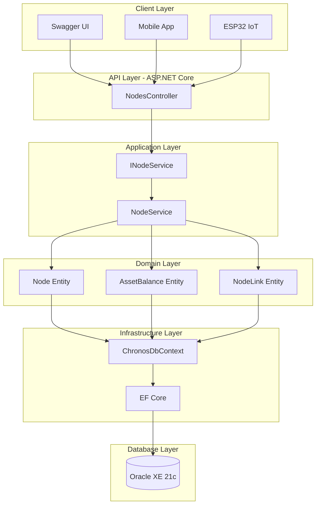
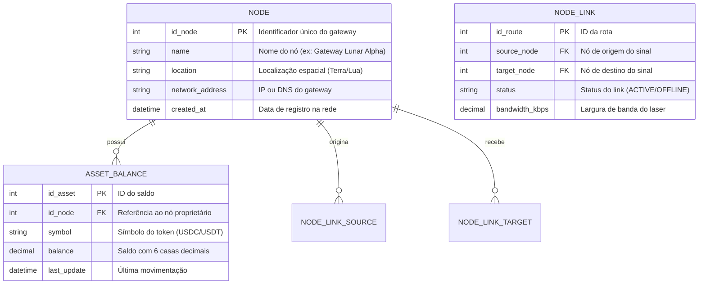

# Chronos DTN — API Backend .NET 8

> Gateway Financeiro e Roteador de Rede DTN (Delay-Tolerant Network) para comunicação Terra-Lua na nova Economia Espacial.

[](https://dotnet.microsoft.com/)
[](https://www.oracle.com/database/)
[](https://docs.microsoft.com/ef/)
[](LICENSE)

---

## 🚀 **O Problema**

No espaço, a internet não funciona como na Terra. Entre a Terra e a Lua existem:
- **Interrupções constantes** de sinal entre satélites
- **Atraso natural** de 1,28 segundos (velocidade da luz)
- **Dilatação temporal** relativística (tempo passa diferente na Lua)

## 💡 **A Solução: Chronos DTN**

Sistema baseado em **DTN (Delay-Tolerant Network)** que:
- Retém transações financeiras em buffer quando não há sinal
- Envia automaticamente quando a janela de comunicação abre
- Corrige matematicamente diferenças de fuso horário interplanetário
- Garante que dinheiro e dados **não se percam no espaço**

---

## 🏗️ **Arquitetura do Sistema**



---

## 📦 **Pré-requisitos**

Antes de executar o projeto, certifique-se de ter instalado:

| Ferramenta | Versão | Download |
|---|---|---|
| [.NET SDK](https://dotnet.microsoft.com/download/dotnet/8.0) | 8.0+ | https://dotnet.microsoft.com/download |
| [Oracle Database XE](https://www.oracle.com/database/technologies/xe-downloads.html) | 21c | https://www.oracle.com/database/technologies/xe-downloads.html |
| [Git](https://git-scm.com/downloads) | 2.x+ | https://git-scm.com/downloads |
| [Visual Studio / VS Code](https://code.visualstudio.com/) | Qualquer | https://code.visualstudio.com/ |

---

## ⚙️ **Como Executar o Projeto**

### 1. Clonar o repositório

```bash
git clone https://github.com/ChronosDTN/backend-dotnet.git
cd backend-dotnet
```

### 2. Configurar a Connection String

Crie o arquivo `appsettings.Development.json` na raiz do projeto (já ignorado pelo `.gitignore`):

```json
{
  "ConnectionStrings": {
    "DefaultConnection": "User Id=SEU_USUARIO;Password=SUA_SENHA;Data Source=localhost:1521/XE;"
  }
}
```

> ⚠️ **Nunca commite credenciais.** O arquivo `appsettings.Development.json` está no `.gitignore`.

### 3. Restaurar dependências

```bash
dotnet restore
```

### 4. Aplicar as Migrations

```bash
dotnet ef database update
```

Isso criará as tabelas `T_CDTN_NODE_REGISTRY`, `T_CDTN_ASSET_BALANCES` e `T_CDTN_DYNAMIC_ROUTES` no banco Oracle.

### 5. Rodar o projeto

```bash
dotnet run
```

### 6. Acessar o Swagger UI

Abra no navegador:

```
https://localhost:5001/swagger
```

ou

```
http://localhost:5000/swagger
```

---

## 🧪 **Exemplos de Testes da API**

### POST /api/nodes — Criar nó gateway

```bash
curl -X POST https://localhost:5001/api/nodes \
  -H "Content-Type: application/json" \
  -d '{
    "name": "Gateway Terra-1",
    "location": "Terra",
    "networkAddress": "192.168.1.1"
  }'
```

**Resposta esperada (201 Created):**
```json
{
  "idNode": 1,
  "name": "Gateway Terra-1",
  "location": "Terra",
  "networkAddress": "192.168.1.1",
  "createdAt": "2025-06-09T13:00:00Z",
  "balances": []
}
```

---

### GET /api/nodes — Listar todos os nós

```bash
curl -X GET https://localhost:5001/api/nodes
```

**Resposta esperada (200 OK):**
```json
[
  {
    "idNode": 1,
    "name": "Gateway Terra-1",
    "location": "Terra",
    "networkAddress": "192.168.1.1",
    "createdAt": "2025-06-09T13:00:00Z",
    "balances": []
  },
  {
    "idNode": 2,
    "name": "Gateway Lua-1",
    "location": "Lua",
    "networkAddress": "10.0.1.1",
    "createdAt": "2025-06-09T13:05:00Z",
    "balances": []
  }
]
```

---

### GET /api/nodes/{id} — Buscar nó por ID

```bash
curl -X GET https://localhost:5001/api/nodes/1
```

**Resposta esperada (200 OK):**
```json
{
  "idNode": 1,
  "name": "Gateway Terra-1",
  "location": "Terra",
  "networkAddress": "192.168.1.1",
  "createdAt": "2025-06-09T13:00:00Z",
  "balances": [
    {
      "idAsset": 1,
      "symbol": "USDC",
      "balance": 50000.000000,
      "lastUpdate": "2025-06-09T13:00:00Z"
    }
  ]
}
```

**Resposta quando não encontrado (404 Not Found):**
```json
{
  "message": "Nó com ID 99 não encontrado na rede DTN."
}
```

---

### PUT /api/nodes/{id} — Atualizar nó

```bash
curl -X PUT https://localhost:5001/api/nodes/1 \
  -H "Content-Type: application/json" \
  -d '{
    "name": "Gateway Terra-1 (Atualizado)",
    "location": "Terra",
    "networkAddress": "192.168.1.10"
  }'
```

**Resposta esperada (204 No Content):** *(sem body)*

**Resposta de validação inválida (400 Bad Request):**
```json
{
  "Name": ["The Name field is required."]
}
```

---

### DELETE /api/nodes/{id} — Deletar nó

```bash
curl -X DELETE https://localhost:5001/api/nodes/1
```

**Resposta esperada (204 No Content):** *(sem body)*

**Resposta com links ativos (409 Conflict):**
```json
{
  "message": "Não é possível deletar este nó pois existem links de topologia ativos. Remova os links primeiro."
}
```

---

## 📊 **Diagrama Entidade-Relacionamento (ER)**

### **Modelo de Dados Completo**



---

## 🔗 **Explicação dos Relacionamentos**

### 1. Relacionamento 1:N — Node → AssetBalance

**Cardinalidade:** Um nó pode ter zero ou muitos saldos de ativos (`1..* → 0..*`).

```
NODE (1) ──────────────── (N) ASSET_BALANCE
         possui/custodia
```

**Por que `Cascade` no Delete?**

O `OnDelete(DeleteBehavior.Cascade)` significa que ao deletar um `Node`, todos os `AssetBalance` associados são automaticamente removidos do banco de dados.

**Justificativa de negócio:** Um saldo de stablecoin (USDC, USDT) só tem sentido se existir um nó gateway para custodiá-lo. Se o gateway é removido da rede DTN, seus saldos deixam de existir logicamente — não faz sentido manter registros financeiros órfãos sem um nó responsável. O `Cascade` garante integridade referencial automaticamente.

---

### 2. Relacionamento N:N — Node ↔ NodeLink

**Cardinalidade:** Um nó pode originar múltiplos links e receber múltiplos links (`N:N` através de tabela intermediária `NODE_LINK`).

```
NODE (N) ──────── NODE_LINK ──────── (N) NODE
         origina              recebe
```

**Por que `Restrict` no Delete?**

O `OnDelete(DeleteBehavior.Restrict)` **bloqueia** a deleção de um `Node` se ele ainda possuir links de topologia ativos como origem (`SourceNode`) ou destino (`TargetNode`).

**Justificativa técnica:** Deletar um nó que ainda é ponto de roteamento quebraria silenciosamente a topologia da rede DTN — outros nós tentariam rotear pacotes para um destino inexistente, causando perda de dados no espaço. O `Restrict` força o operador a remover explicitamente todos os links antes de desativar um gateway, garantindo que a remoção seja uma decisão consciente e que a rede seja reconfigurada de forma controlada.

---

## 🎯 **Testes Realizados**

### Fluxo de Teste Manual Completo

**Passo 1 — Criar 3 nós da rede:**

```bash
# Terra-1
curl -X POST http://localhost:5000/api/nodes -H "Content-Type: application/json" \
  -d '{"name":"Gateway Terra-1","location":"Terra","networkAddress":"192.168.1.1"}'

# Lua-1
curl -X POST http://localhost:5000/api/nodes -H "Content-Type: application/json" \
  -d '{"name":"Gateway Lua-1","location":"Lua","networkAddress":"10.0.1.1"}'

# Satélite-1
curl -X POST http://localhost:5000/api/nodes -H "Content-Type: application/json" \
  -d '{"name":"Satelite-1","location":"Orbita","networkAddress":"172.16.0.1"}'
```

**Passo 2 — Testar validação de campo obrigatório:**

```bash
curl -X POST http://localhost:5000/api/nodes -H "Content-Type: application/json" \
  -d '{"name":"","location":"Terra","networkAddress":"192.168.1.2"}'
# Esperado: 400 Bad Request
```

**Passo 3 — Testar deleção com restrição de links:**

```bash
# Tentar deletar nó que tem links → deve retornar 409
curl -X DELETE http://localhost:5000/api/nodes/1
# Esperado: 409 Conflict
```

**Passo 4 — Testar nó inexistente:**

```bash
curl -X GET http://localhost:5000/api/nodes/999
# Esperado: 404 Not Found
```

### Validações Implementadas

| Campo | Regra | Resposta |
|---|---|---|
| `Name` | Obrigatório, máx. 100 chars | 400 Bad Request |
| `Location` | Obrigatório, máx. 50 chars | 400 Bad Request |
| `NetworkAddress` | Obrigatório, máx. 100 chars | 400 Bad Request |
| Delete com links | FK Restrict no banco | 409 Conflict |
| ID inexistente | Verificação no service | 404 Not Found |

---

## 🚀 **Viabilidade e Inovação**

### Por que o Chronos DTN é inovador?

**1. Problema real e urgente**
Com o programa Artemis da NASA e missões lunares previstas para 2025-2030, a comunicação financeira Terra-Lua é um problema que precisará de solução antes que a primeira colônia lunar seja estabelecida.

**2. Uso de tecnologia DTN (Delay-Tolerant Network)**
A arquitetura DTN é usada pela NASA e ESA para comunicação interplanetária. Adaptá-la para transações financeiras é uma aplicação pioneira — nenhuma solução financeira existente foi projetada para operar com latências de 1,28 segundos e interrupções constantes de sinal.

**3. Primeira solução financeira interplanetária**
Enquanto Visa, Mastercard e até o Bitcoin assumem conectividade constante, o Chronos DTN foi projetado especificamente para operar em modo *store-and-forward*: retém transações localmente e as transmite quando a janela de comunicação abre.

**4. Correção temporal relativística**
A dilatação temporal na Lua (mais próxima da Terra, menos gravidade) faz o tempo passar ligeiramente mais rápido. Para contratos financeiros com timestamps precisos, isso importa. O Chronos contempla a correção matemática desse efeito relativístico.

---

## 🎥 **Vídeos de Demonstração**

### 📹 Vídeo Demonstração Técnica (8 minutos)

> 🔗 **Link:** *(a ser adicionado após gravação)*

**Conteúdo planejado:**
- 00:00 — Introdução ao projeto e problema
- 01:00 — Estrutura do código (Clean Architecture)
- 02:30 — Demonstração do Swagger UI
- 03:30 — Criando nós Terra, Lua e Satélite via API
- 05:00 — Testando restrição de deleção com links ativos
- 06:00 — Visualizando banco Oracle (tabelas e dados)
- 07:00 — Rodando os testes unitários
- 07:30 — Conclusão e próximos passos

---

### 🎤 Vídeo Pitch (3 minutos)

> 🔗 **Link:** *(a ser adicionado após gravação)*

**Conteúdo planejado:**
- 00:00 — O problema: por que a internet espacial não funciona para finanças?
- 01:00 — A solução: Chronos DTN e como funciona
- 02:00 — Impacto: quem usa e por quê isso importa agora
- 02:30 — Tecnologia e inovação
- 02:50 — Call to action

---

## 👥 **Equipe**

| Nome | RM | Função |
|---|---|---|
| *(Adicionar nome)* | RM XXXXX | Backend .NET / Arquitetura |
| *(Adicionar nome)* | RM XXXXX | Banco de Dados / Oracle |
| *(Adicionar nome)* | RM XXXXX | Mobile / IoT |

---

## 📄 **Licença**

Este projeto está licenciado sob a [MIT License](LICENSE).
